# アカウントを作成する

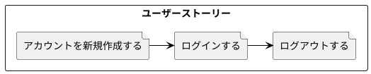

# プロフィールを作成する

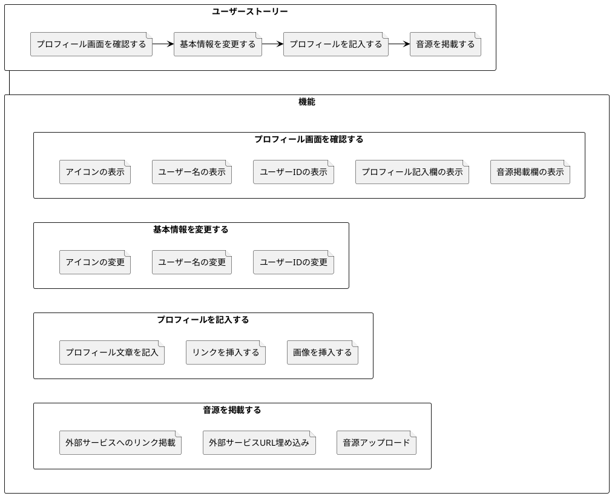

# お金に関する情報を設定する

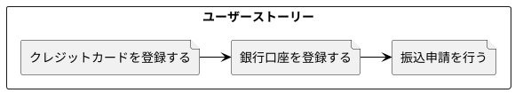

# イベントを作成する

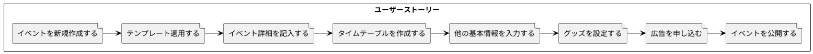

# イベントを見つける

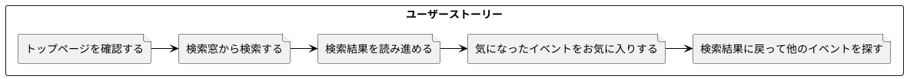

# DJの募集に申し込む

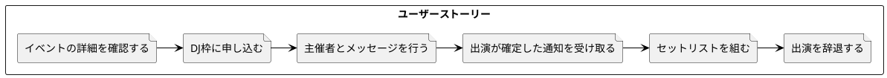

# 観客としてイベントに申し込む

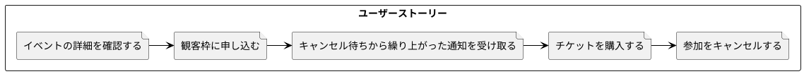

# イベント当日に会場に入場する

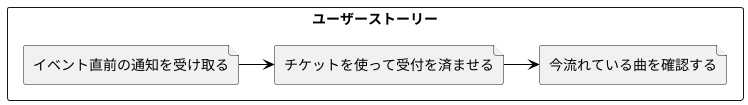

# イベントの事後処理を行う

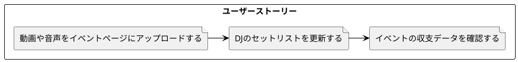

# 他のユーザーのプロフィールを閲覧する

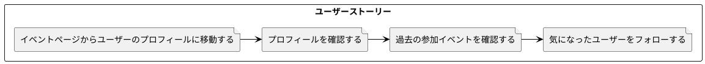

# 過去のイベントを振り返る

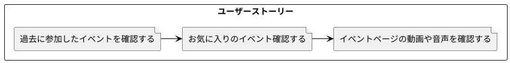

# レコメンドを受け取ってイベントを知る

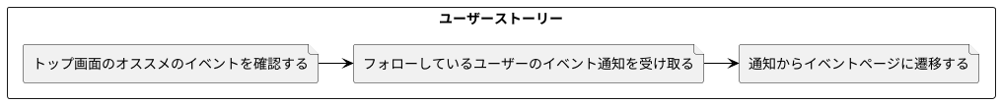

# ひな形

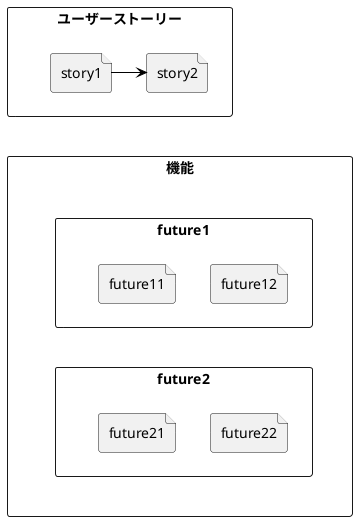
